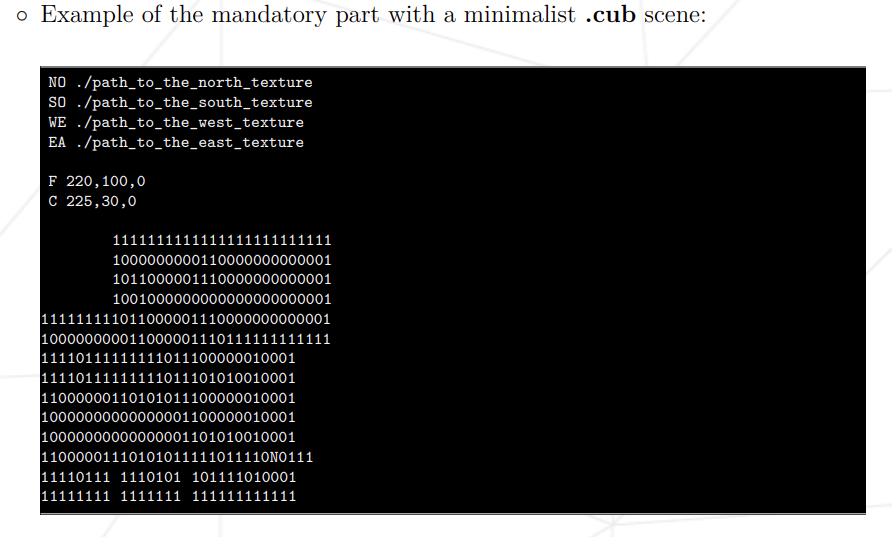

# cub3D
My first RayCaster with miniLibX

				                *** MAP RULES ***

◦ The map must be composed of only 6 possible characters: 0 for an empty space,
1 for a wall, and N,S,E or W for the player’s start position and spawning
orientation.

◦ The map must be closed/surrounded by walls, if not the program must return
an error

◦ Except for the map content, each type of element can be separated by one or
more empty line(s).

◦ Except for the map content which always has to be the last, each type of
element can be set in any order in the file.

◦ Except for the map, each type of information from an element can be separated
by one or more space(s).

◦ The map must be parsed as it looks in the file. Spaces are a valid part of the
map and are up to you to handle. You must be able to parse any kind of map,
as long as it respects the rules of the map.

◦ Each element (except the map) firsts information is the type identifier (composed by one or two character(s)), followed by all specific informations for each
object in a strict order such as:
        
        ∗ North texture:
            NO ./path_to_the_north_texture
                · identifier: NO
                · path to the north texure
        
        ∗ Ceiling color:
            C 225,30,0
                · identifier: C
                · R,G,B colors in range [0,255]: 0, 255, 255
        
         

◦ If any misconfiguration of any kind is encountered in the file, the program
must exit properly and return "Error\n" followed by an explicit error message
of your choice.
